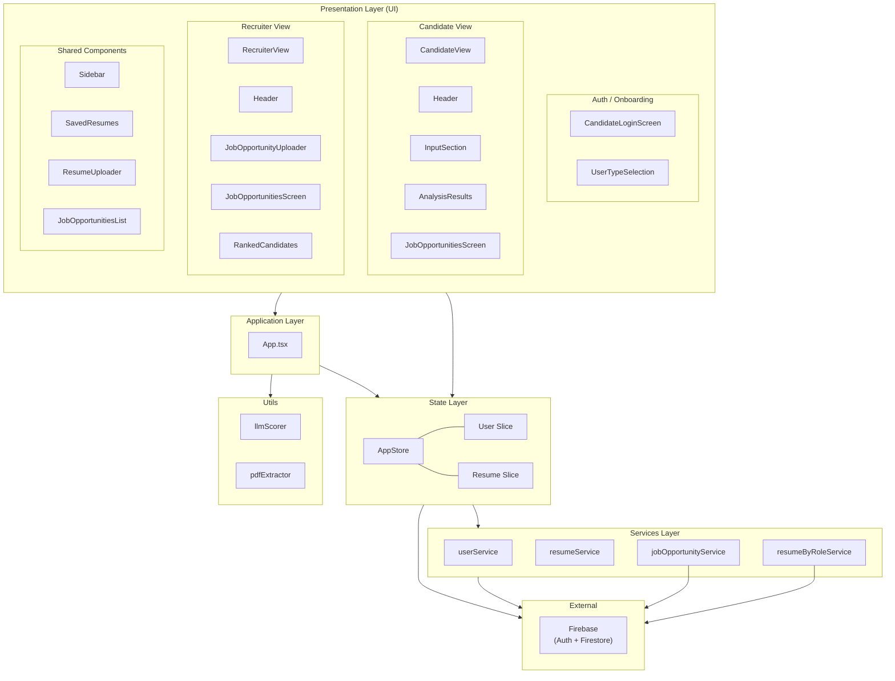
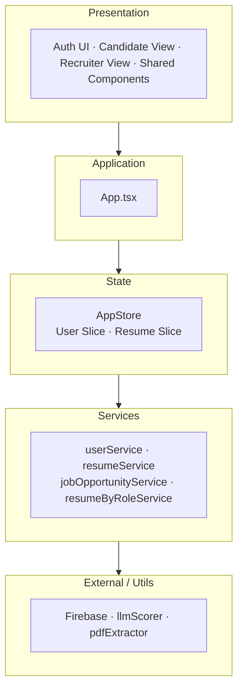
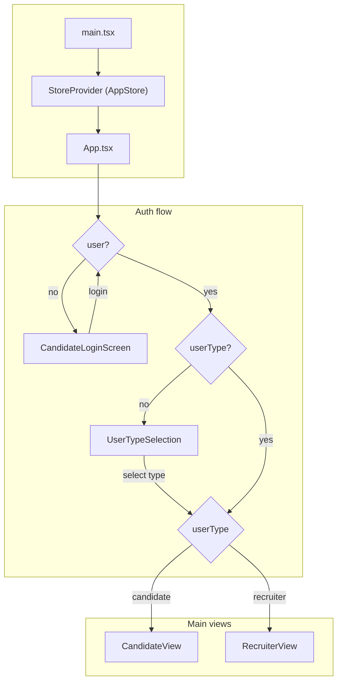
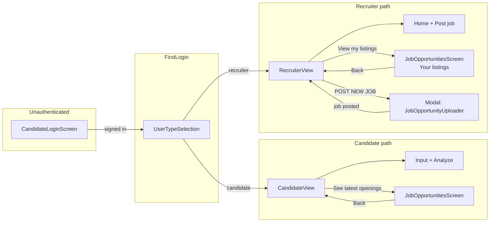
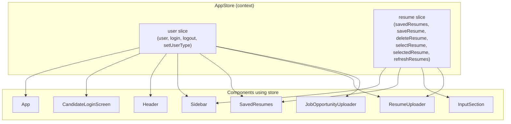
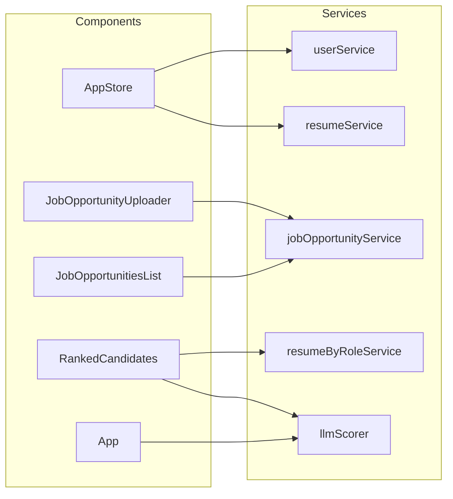

# TalentLens – Flow & Component Architecture

## HLD – High Level Design (box diagram)



**Layer summary:**

| Layer | Boxes | Responsibility |
|-------|--------|----------------|
| **Presentation** | Auth UI, Candidate View, Recruiter View, Shared Components | Screens & reusable UI; user input & display |
| **Application** | App.tsx | Routing logic (login → user type → candidate vs recruiter); orchestrates views |
| **State** | AppStore (User Slice, Resume Slice) | Single source of truth; auth + resume state; `useAuth` / `useResumes` |
| **Services** | userService, resumeService, jobOpportunityService, resumeByRoleService | API / persistence; Firestore, job CRUD, resume-by-role |
| **Utils** | llmScorer, pdfExtractor | Resume scoring (LLM), PDF text extraction |
| **External** | Firebase | Auth, Firestore |

**Simplified HLD (one box per layer):**



---

## 1. Application entry & flow (high level)



---

## 2. Screen flow (what the user sees)



---

## 3. Component tree (parent → children)

```
main.tsx
└── StrictMode
    └── StoreProvider (AppStore)
        └── App
            ├── [if !user] CandidateLoginScreen
            │   └── (login UI only)
            │
            ├── [if showUserTypeModal] UserTypeSelection
            │   └── (Candidate | Recruiter picker)
            │
            ├── [if userType === 'recruiter'] RecruiterView
            │   ├── Header
            │   │   └── HamburgerMenu
            │   │       └── Sidebar
            │   │           └── SavedResumes
            │   │               └── SavedResumeCard (per resume)
            │   ├── "POST NEW JOB" button
            │   ├── main
            │   │   ├── [if showJobOpportunitiesScreen] JobOpportunitiesScreen
            │   │   │   └── JobOpportunitiesList
            │   │   │       ├── (job cards with Expand)
            │   │   │       └── RankedCandidates (per expanded job)
            │   │   └── [else] hint + "View my listings"
            │   ├── Footer
            │   └── Modal
            │       └── JobOpportunityUploader
            │           └── RoleFilters
            │
            └── [else candidate] CandidateView
                ├── Header
                │   └── HamburgerMenu
                │       └── Sidebar
                │           └── SavedResumes
                │               └── SavedResumeCard (per resume)
                ├── "See latest openings" bar
                ├── main
                │   ├── [if showJobOpportunitiesScreen] JobOpportunitiesScreen
                │   │   └── JobOpportunitiesList
                │   └── [else]
                │       ├── InputSection
                │       │   ├── RoleFilters
                │       │   ├── ResumeUploader
                │       │   ├── JobDescriptionInput
                │       │   ├── AnalyzeButton
                │       │   └── ErrorMessage (if error)
                │       └── [if result] AnalysisResults
                │           └── ScoreDisplay
                └── Footer
```

---

## 4. Data flow & context usage

### 4.1 Single store (AppStore)

- **Provider:** `StoreProvider` in `main.tsx` wraps the whole app.
- **Keys:** `user` (auth slice), `resume` (resume slice).
- **Hooks:** `useStore()`, `useAuth()`, `useResumes()`.

### 4.2 Who uses AppStore

| Component / module        | useAuth | useResumes |
|---------------------------|--------|------------|
| App                       | ✓ (user, setUserType) | — |
| CandidateLoginScreen      | ✓ (login, isLoading)  | — |
| Header                    | ✓ (user, login, logout) | — |
| HamburgerMenu             | — (gets user/login/logout via props from Header) | — |
| Sidebar                   | — (user via props)    | ✓ (savedResumes) |
| SavedResumes              | ✓ (user)             | ✓ (savedResumes, deleteResume, selectedResume, selectResume, isLoading, error) |
| InputSection              | —                    | ✓ (selectResume) |
| ResumeUploader            | ✓ (user)             | ✓ (savedResumes, saveResume, selectedResume) |
| JobOpportunityUploader    | ✓ (user)             | — |

### 4.3 Props flow (key callbacks & state)

- **App → CandidateView:**  
  `resumeText`, `jobDescription`, `selectedRole`, `selectedExperience`, `result`, `isLoading`, `error`, `onResumeSelect`, `onResumeChange`, `onJobDescriptionChange`, `onRoleChange`, `onExperienceChange`, `onAnalyze`, `scrollToResumeSection`, `showJobOpportunitiesScreen`, `onOpenJobOpportunities`, `onCloseJobOpportunitiesScreen`.

- **App → RecruiterView:**  
  `onResumeSelect`, `currentResumeText`, `scrollToResumeSection`, `onOpenJobOpportunities`, `showJobOpportunitiesScreen`, `onCloseJobOpportunitiesScreen`, `recruiterId`, `recruiterJobsRefreshTrigger`, `showPostJobModal`, `onOpenPostJobModal`, `onClosePostJobModal`, `onJobPosted`.

- **CandidateView → Header:**  
  `onResumeSelect`, `currentResumeText` (= resumeText), `scrollToResumeSection`.

- **Header → HamburgerMenu:**  
  `user`, `userType`, `onLogin`, `onLogout`, `onResumeSelect`, `currentResumeText`, `onScrollToResumeSection`.

- **HamburgerMenu → Sidebar:**  
  same + `isOpen`, `onClose`.

- **Sidebar → SavedResumes:**  
  `onSelectResume` (wired to parent `onResumeSelect`), `currentResumeText`, `onScrollToResumeSection`.

- **CandidateView → InputSection:**  
  resume/job/role/experience state, `onResumeChange`, `onJobDescriptionChange`, `onRoleChange`, `onExperienceChange`, `onAnalyze`, `isLoading`, `error`.

- **InputSection → ResumeUploader:**  
  `onTextExtracted`, `extractedText`, `selectedRole`, `selectedExperience`, `jobDescription`.

- **RecruiterView → JobOpportunitiesScreen:**  
  `onBack`, `recruiterId`, `refreshTrigger`, `onEditJob` (opens modal with job to edit).

- **RecruiterView → Modal → JobOpportunityUploader:**  
  `existingJob` (when editing), `onJobPosted`.

- **JobOpportunitiesList → RankedCandidates:**  
  `job` (when a job card is expanded).



---

## 5. Services & who calls them

| Service                   | Used by / purpose |
|---------------------------|-------------------|
| **userService**           | AppStore: `getUserProfile`, `createOrUpdateUserProfile` (auth + set user type). |
| **resumeService**         | AppStore: `getUserResumes`, `saveResume`, `deleteResume` (resume slice). |
| **jobOpportunityService** | JobOpportunitiesList: `getJobOpportunities`, `deleteJobOpportunity`. JobOpportunityUploader: `createJobOpportunity`, `updateJobOpportunity`. |
| **resumeByRoleService**   | RankedCandidates: `getResumesByRole` (fetch candidates by role for a job). |
| **llmScorer** (utils)    | App: `scoreResume` (candidate analyze). RankedCandidates: `scoreResume` (rank candidates for a job). |



---

## 6. File map (quick reference)

| Area        | Files |
|------------|--------|
| Entry      | `main.tsx` |
| App / flow | `App.tsx` |
| Store      | `context/AppStore.tsx`, `context/slices/UserSlice.ts`, `context/slices/ResumeSlice.ts` |
| Screens    | `screens/CandidateView.tsx`, `screens/RecruiterView.tsx`, `screens/JobOpportunitiesScreen.tsx` |
| Auth / onboarding | `components/CandidateLoginScreen`, `components/UserTypeSelection` |
| Layout     | `components/Header`, `components/HamburgerMenu`, `components/Sidebar`, `components/Footer` |
| Resume     | `components/InputSection`, `components/ResumeUploader`, `components/SavedResumes`, `components/SavedResumeCard` |
| Analysis   | `components/AnalysisResults`, `components/ScoreDisplay` |
| Jobs       | `components/JobOpportunitiesList`, `components/JobOpportunityUploader`, `components/RankedCandidates` |
| Shared UI  | `components/RoleFilters`, `components/JobDescriptionInput`, `components/AnalyzeButton`, `components/ErrorMessage`, `components/ui/Modal` |
| Services   | `services/userService`, `services/resumeService`, `services/jobOpportunityService`, `services/resumeByRoleService` |
| Utils      | `utils/llmScorer`, `utils/pdfExtractor`, `utils/getErrorMessage`, etc. |

---

## 7. End-to-end user flows (summary)

1. **Anonymous → Candidate**
   - Open app → CandidateLoginScreen → Sign in with Google → UserTypeSelection (pick Candidate) → CandidateView → upload/paste resume, set role/experience, analyze → see AnalysisResults (ScoreDisplay).

2. **Candidate: see jobs**
   - CandidateView → “See latest openings” → JobOpportunitiesScreen (JobOpportunitiesList, all jobs) → Back → CandidateView.

3. **Anonymous → Recruiter**
   - Open app → CandidateLoginScreen → Sign in → UserTypeSelection (pick Recruiter) → RecruiterView → “POST NEW JOB” → Modal with JobOpportunityUploader → submit → list refreshes.

4. **Recruiter: manage jobs**
   - RecruiterView → “View my listings” → JobOpportunitiesScreen with `recruiterId` → list of recruiter’s jobs; Edit opens Modal (JobOpportunityUploader with `existingJob`); Delete calls jobOpportunityService.

5. **Recruiter: rank candidates**
   - In JobOpportunitiesList, expand a job → RankedCandidates loads resumes by role (resumeByRoleService), runs scoreResume (llmScorer), shows ranked list.

6. **Resume from sidebar (both roles)**
   - Header → HamburgerMenu → Sidebar → SavedResumes → pick a SavedResumeCard → `onResumeSelect` → parent (App) updates resume text/role/experience/jobDescription and optionally scrolls to resume section (CandidateView) or stays on RecruiterView with selected resume text.

This document reflects the refactored single-store (AppStore) and the removal of AuthContext/ResumeContext as separate files.
